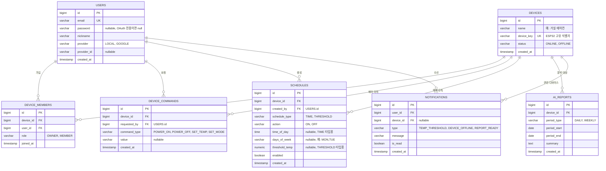

# ERD (PostgreSQL)

> 센서 시계열 데이터(온습도 등)는 별도 시계열 DB(예: InfluxDB)로 분리하고, 여기서는 PostgreSQL에 들어가는 관계형 데이터만 다룹니다.

## 다이어그램

## 설계 메모

- **디바이스 공유**: `DEVICE_MEMBERS`로 사용자-디바이스를 N:M 연결. `role`로 OWNER/MEMBER 구분(소유권 위임 가능하게 role 변경으로 처리).
- **사용자 인증**: `provider`로 로컬 계정과 Google OAuth2 계정을 구분. OAuth 전용 계정은 `password`가 null.
- **센서 데이터 제외**: 시계열 데이터는 이 스키마에 없음 — 디바이스는 `device_key`로 외부 시계열 DB의 데이터와 연결.
- **제어 이력(`DEVICE_COMMANDS`)**: 에어컨 On/Off, 온도/모드 변경 등 사용자가 보낸 제어 명령의 감사 로그.
- **자동화(`SCHEDULES`)**: 예약(TIME)과 온도 기준 규칙(THRESHOLD)을 한 테이블에서 `schedule_type`으로 구분. 조건이 복잡해지면 이후 분리 검토.

## 결정 필요 사항

- `DEVICE_MEMBERS.role` 외에 세부 권한(제어만 가능/조회만 가능 등)이 필요한지
- `SCHEDULES`의 반복 조건(`days_of_week`)을 문자열 대신 별도 테이블로 정규화할지
- Soft delete(예: `deleted_at`) 적용 범위
